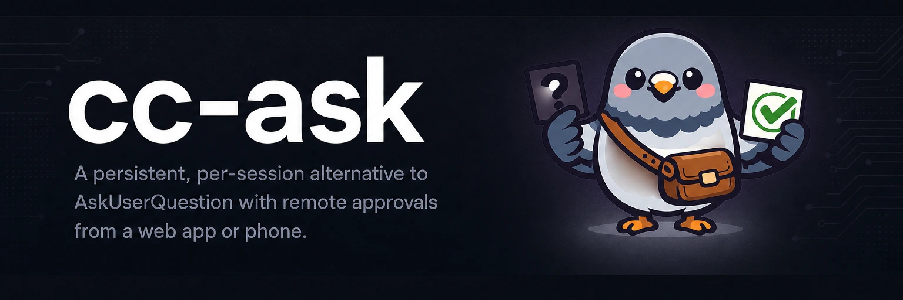

# 

**Stop babysitting the terminal. Your agent's questions ping your phone.** cc-runtime routes AskUserQuestion and PushNotification through a daemon; you tap an answer from web or phone and the run keeps moving.

[](https://github.com/yasyf/cc-runtime/actions/workflows/ci.yml)
[](LICENSE)

## Get started

cc-runtime hasn't cut a release yet. The one-command install, a captured demo, and the agent paste block land here the moment the first one ships. Until then, the pitch above and [AGENTS.md](AGENTS.md) are the spec.

---

## Use cases

### Unblock a long-running agent without walking back to the keyboard

A background agent that calls AskUserQuestion stalls in a terminal you're not looking at, and the question dies with the prompt. Launch the session wrapped instead:

```bash
cc-runtime wrap claude
```

The wrapper strips the native ask/notify tools and steers the agent to cc-runtime's, so every question lands in the daemon and stays open until you answer, with an edit gate holding the agent's writes in the meantime. The TUI answers from any terminal that shares the scope today; the web and phone clients are the next two phases.

### See the reasoning and diff behind every question, not just three option labels

The native picker shows a header chip and a few option labels; you approve or reject without seeing what hinges on the answer. Open the answer surface instead:

```bash
cc-runtime tui
```

Each question card renders the agent's prompt, its reasoning, the option list with per-option previews, and the unified diff it wants you to weigh — the context the native tool never carries.

### Keep a record of what was approved, and when

An approval given in the native picker vanishes the moment the prompt ends. cc-runtime appends every question, answer, and notification to the subject's event log in the daemon's store, so the selected options, free-text notes, and timestamps outlive the session.

---

## How it's built

cc-runtime is a Go daemon on the [cc-interact](https://github.com/yasyf/cc-interact) substrate, shipping as a Claude Code plugin: an MCP channel that exposes `ask` and `notify` in place of the native tools, plus hooks that mirror native AskUserQuestion and PushNotification calls into the event log and enforce the edit gate. The Bubble Tea TUI is the answer surface today; the web app and the iOS client with push delivery are the next two phases.

Status: pre-release — no published install path yet.

Licensed under [PolyForm Noncommercial 1.0.0](LICENSE).
